# reHomr: Connecting Pets with Loving Homes

**reHomr** is a web application designed to streamline the process of connecting pets in need of a home with individuals or families looking to adopt. The platform serves as a bridge between pet owners or rescue organizations and potential adopters, facilitating the adoption process and providing a centralized space for users to explore, learn about, and connect with pets.

## Screenshots (Web)

Landing page:

Log In:
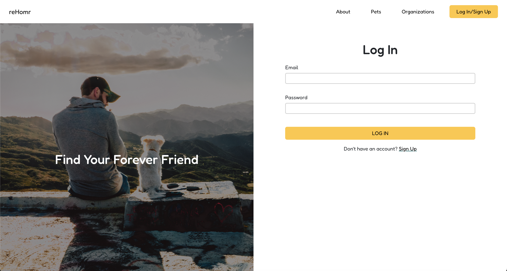

Pets Available:
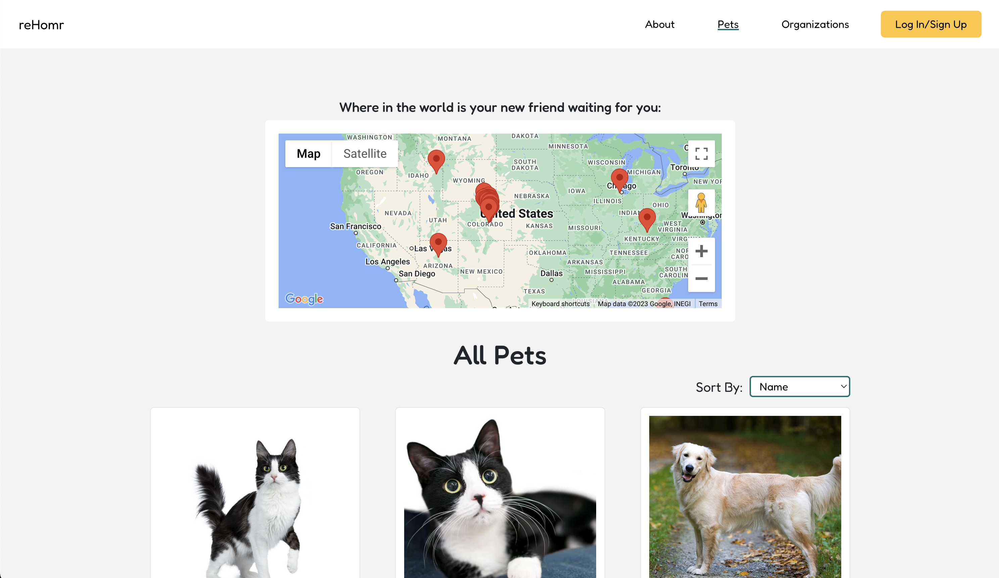

Pet Detail:
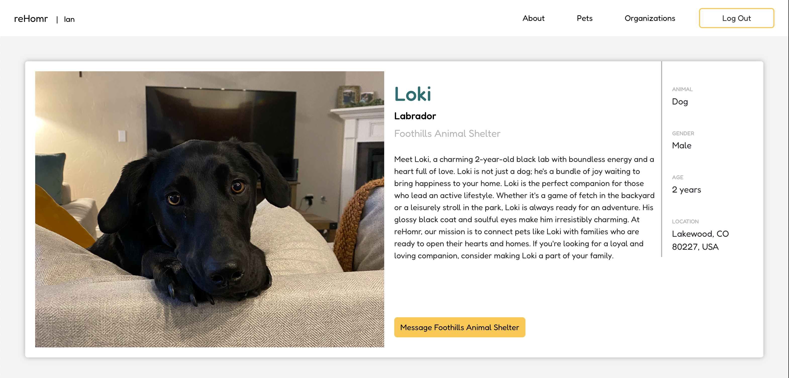
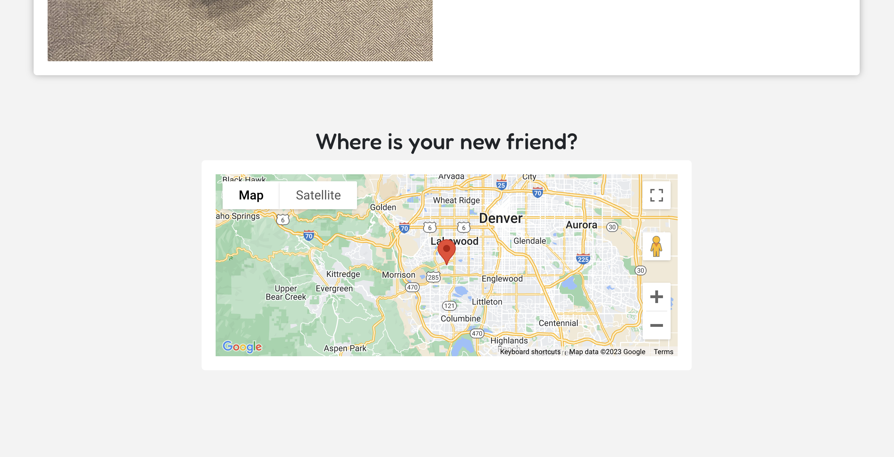

## Screenshots (Mobile - iPhone 14 Pro Max)

### Landing Page:
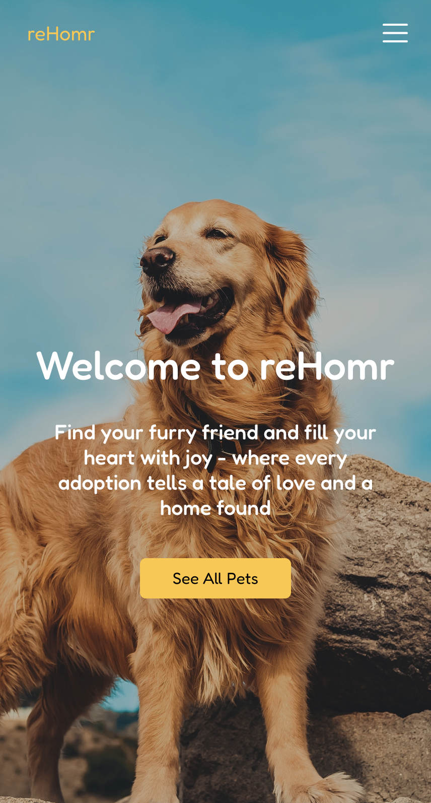

### Offcanvas Nav:
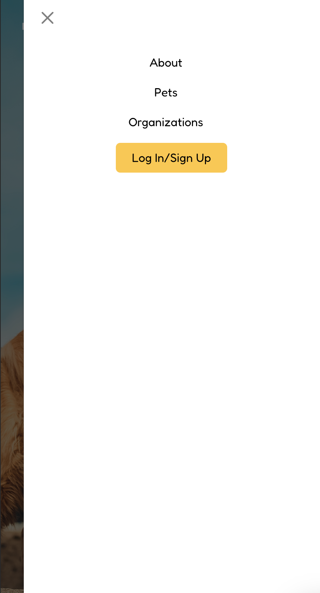

### Log In/Sign Up:

  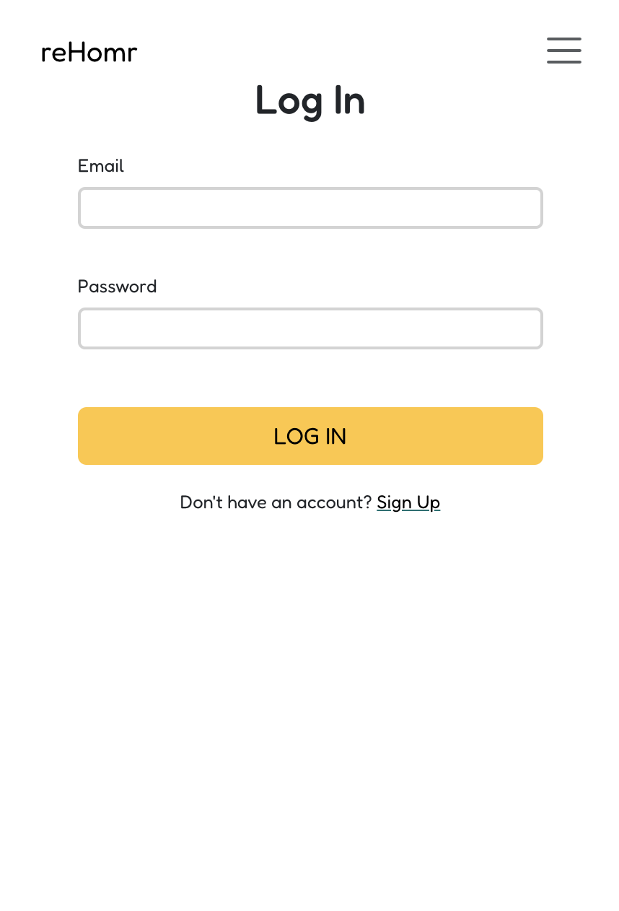
  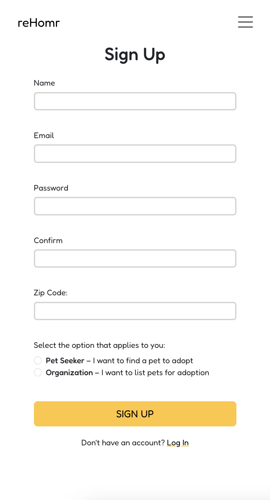

### Pets Available:

  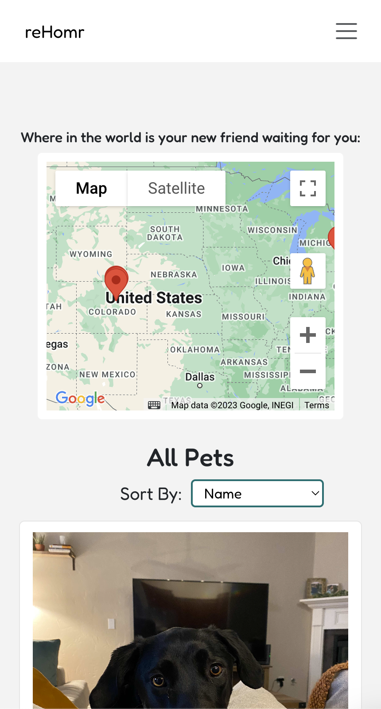
  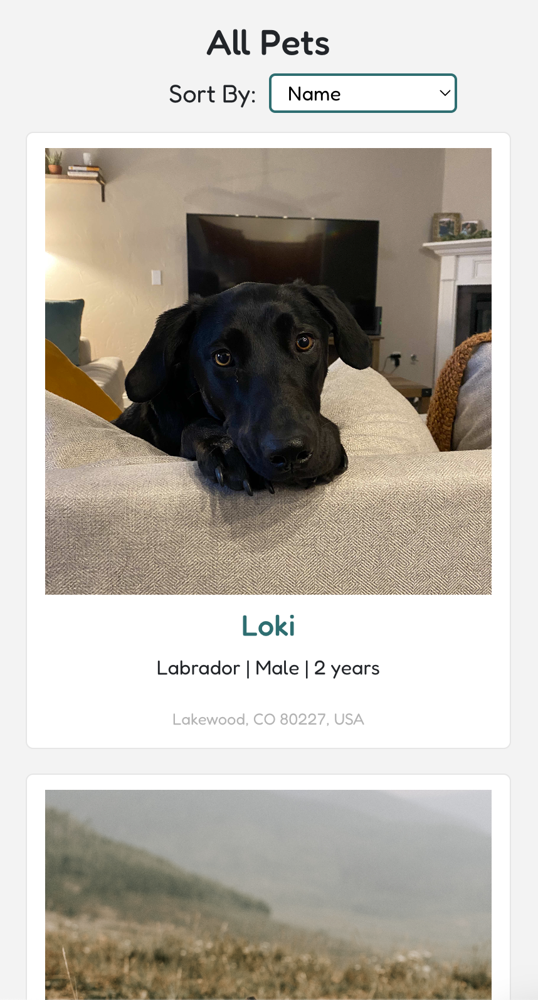

### Pet Detail:

  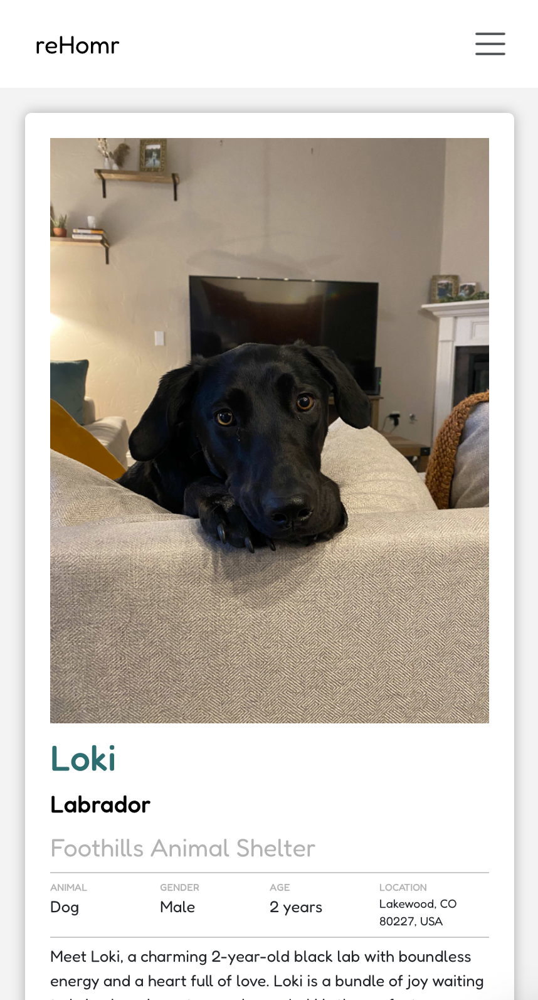
  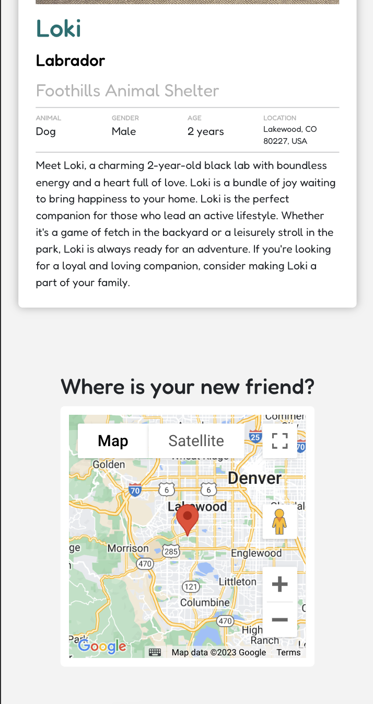

## Technologies Used

**Frontend:**
  - React.js
  - HTML
  - CSS
  - JavaScript

**Backend:**
  - Node.js
  - Express.js
  - MongoDB

**External Libraries and Tools:**
  - Bootstrap (for styling)
  - AJAX/Axios (for making API requests)
  - Trello (for project planning)
  - Figma (for wireframing)
  - Heroku (for deployment)

**Other Technologies:**
  - Google Maps API (for location services)

## Getting Started

- [Deployed App](https://rehomr-58ea4d4dc5ca.herokuapp.com/)
- [Trello Board (User Stories)](https://trello.com/b/1KqPHOwD/sei-rehomr)
- [Figma (Wireframe)](https://www.figma.com/file/byk6manLr3uQvMmUZE5Erb/Project-4---reHomr?type=whiteboard&node-id=0-1&t=wFD32hGv2cRPDrVK-0)

## Next Steps
- Messaging within the site via Socket.io
- AI Matching
- User Profile

